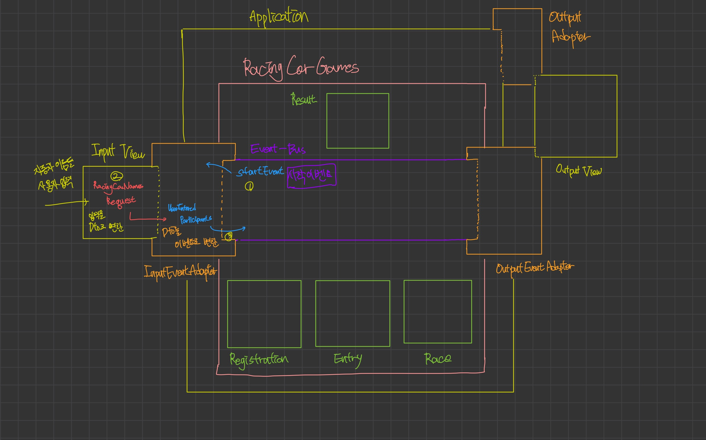
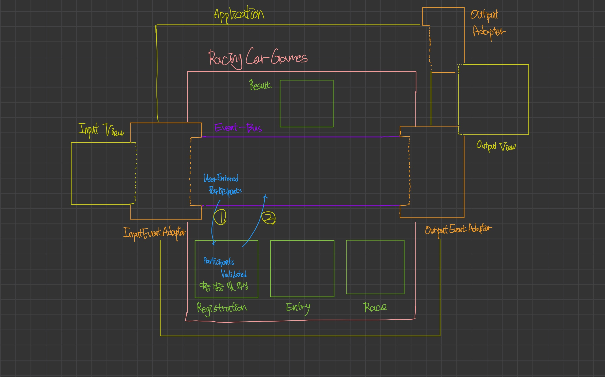
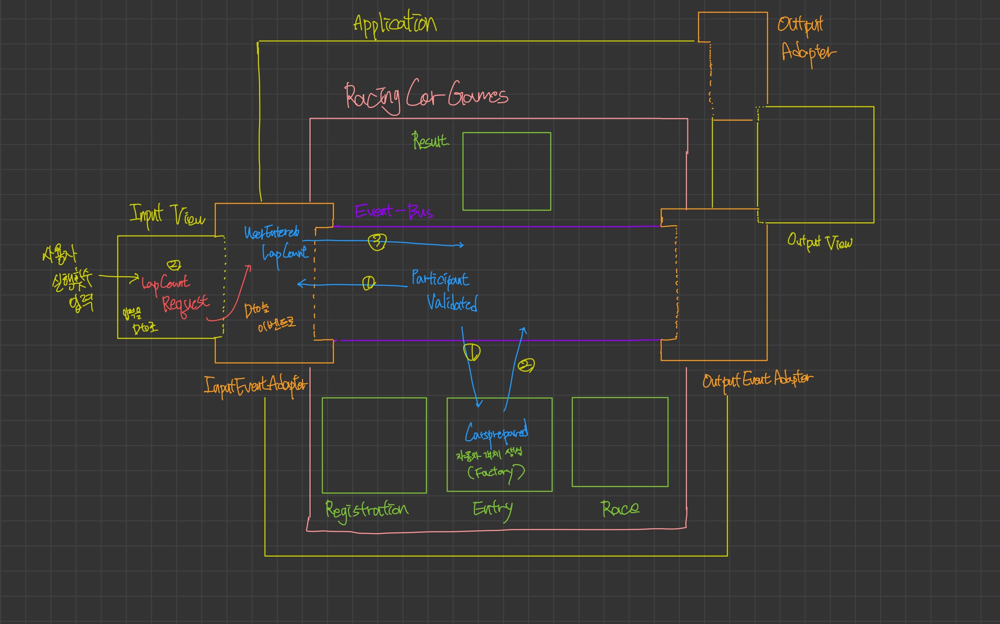
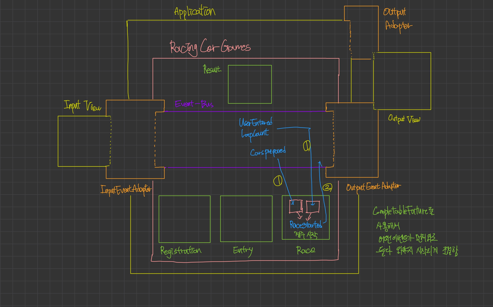
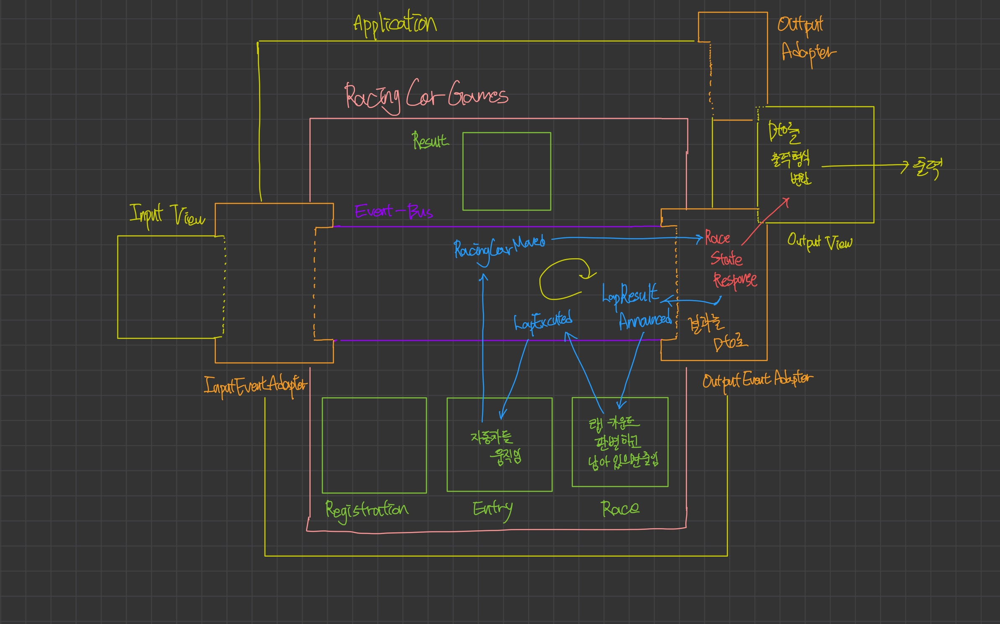
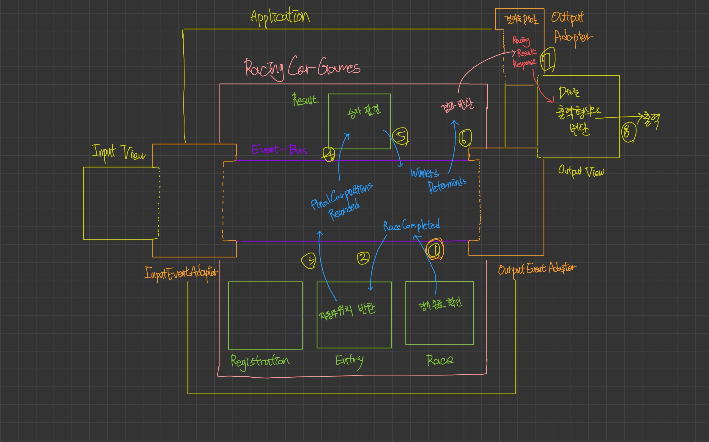

# java-racingcar-precourse

> Event-Driven-Architecture로 구현하는 자동차 경주

[미션 과정에서의 고민들](DECISIONS.md)

## 기능 목록

### 🧩EventBus
- [x] Event Bus
- [x] Event Bus 에서 사용될 이벤트 스키마 정의

---
### 📝 Registration
- [x] 입력 받은 자동차 이름 목록을 파싱한다.
    - [x] 입력 받은 자동차 이름 목록을 검증한다.
    - [x] 입력 받은 자동차 이름을 검증한다.
- [x] 경기에 참여할 자동차 이름 목록을 반환한다.

---
### 🏎️ Entry
- [x] 자동차를 움직인다.
- [x] 자동차의 이름과 움직인 거리를 반환한다.

---
### 💻 I/O
- [x] 사용자로부터 입력을 받는다.
    - [x] 사용자로부터 참여할 자동차 목록을 입력 받는다.
    - [x] 사용자로부터 시도할 횟수(Lap Count)를 입력 받는다.
- [x] 실행 결과를 출력한다.
    - [x] 경기 현황을 출력한다.
    - [x] 우승자를 출력한다.

---
### 🏟️ RACE
- [x] 랩 횟수 입력 값을 검증한다.
- [x] 남은 랩이 있는지 검증한다.

---
### 🏆 Result
- [x] 경주 우승자(들)를 선별한다.

---

## 왜 EDA를 도입했나요??

### 배경

저는 최근 시스템 아키텍처와 동시성 프로그래밍에 관심을 가지고 있습니다.
특히 이벤트 버스를 활용한 비동기 EDA의 유연성과 확장성에 주목했고,
2주차 자동차 경주 미션에서 이를 적용해볼 기회를 발견했습니다.

물론, CLI 환경의 순수 자바로 진행되는 과제에서 이런 아키텍처는 과하다 생각했습니다.
그럼에도, 관심사의 분리, 계층간 책임, 모듈 캡슐화, 비동기 EDA 패턴 및 I/O 병목을 동시성으로 해결하려는
아키텍처 사고를 개념적으로 표현하는 것에 도전하고 싶어서 진행해봤습니다.🙂

이 미션은 두 번의 사용자 입력을 필요로 합니다.

```
[자동차 이름 입력] → (사용자 생각 시간) → [시도 횟수 입력]
```

사용자가 시도 횟수를 생각하고 입력하는 동안,
이미 받은 자동차 이름들을 검증하고 경주 준비하는 작업을 비동기로 처리한다면
시도 횟수 입력 즉시 레이스를 시작할 수 있다고 생각했습니다.

또한 EDA를 통해 관심사를 분리하면

- InputEventAdapter : InputView와의 소통만
- OutputEventAdapter : OutputView와의 소통만
- Registration 도메인: 자동차 이름 파싱
- Entry 도메인: 자동차 움직임
- Race 도메인: 경기 진행
- Result 도메인: 경기 결과

각 도메인이 이벤트로만 통신하므로 응집도 높고 변경에 유연한 구조를 만들 수 있다고 생각했습니다.

<details>
<summary>구현 그 이후...</summary>

그냥 실행했을 때는 정상적으로 동작했지만,
`Application.기능_테스트()`가 제 코드에는 플래키 테스트로 적용됨을 식별했습니다.
(@RepeatedTest(1000)으로 식별 결과 1/3가량은 실패)

이 경우에 어떤식으로 처리되는지, 이대로 제출해도 될지 궁금해서 문의를 드렸지만
기재되지 않은 부분은 스스로 판단해서 구현해야 한다는 답을 주셨고,
스스로 다시 생각해봐도, 상황에 머물러 답을 바라지 말고, 
정해진 조건에 맞춰 항상 통과하는 코드를 구현해내는게 옳다고 판단했습니다.

여러 시행착오 끝에 테스트가 실행된 환경을 식별하는 경우, 
작업 당 생성되는 가상의 스레드에게 비동기 처리를 할당하는 것이 아니라
기존 테스트가 실행된 스레드에서 동기적으로 동작하게 만들었습니다.

이 경우 비동기 처리의 장점을 살리지 못하고, 
테스트를 통과하기 위한 테스트 훅이 추가됐다는 점에서 아쉬운 점이 있습니다.😥

추가로, 이벤트 체인에 대한 테스트를 작성에 어려움을 겪었습니다.
이벤트 A → B → C → D로 이어지는 체인을 테스트하려면 모든 핸들러를 다 등록해야 했고, 
이벤트 체인으로 흐름이 굴러갔기 때문에 전체 흐름을 파악하기 어려웠습니다.

한편으로는, EDA의 장점도 분명히 느낄 수 있었습니다. 

실제로 기능을 수정하거나 추가할 때, 기존 코드를 건드리지 않고도 새로운 이벤트 핸들러만 추가하면 되는 확장성이 좋았고,
각 모듈이 서로 직접 의존하지 않아 독립적으로 수정할 수 있었습니다. 
또한, 관심사가 명확하게 분리되는 느낌도 받았습니다.

문득 깨달은 건, EDA든 일반적인 Controller 방식이든 결국 같은 비즈니스 로직을 다른 방식으로 연결하는 것일 뿐이라는 거였습니다.

"좋은 아키텍처"라는 게 따로 있는 게 아니라, 프로젝트 상황에 맞는 선택이 중요하다는 걸 몸소 배웠습니다. 

<b>다음 미션에서는 더 적합한 방식을 선택해봐야겠다고 다짐했습니다.<b>🙂

</details>


---
## 🔥이슈

### 😵‍💫 `ApplicationTest.기능_테스트()` 이슈

> 2주차에서 가장 고생했고, 가장 많이 배움을 얻은 부분입니다.

Mokito, JUnit, 비동기, 멀티스레드에 대한 깊은 지식이 없었고,
복잡한 아키텍처로 이슈를 곧장 파악하지 못했었습니다.<br><br>

정확한 지식이 없으니 시간만 날리며 이 방법,저 방법 시도해보다가
문득 `ApplicationTest.기능_테스트()`를 살펴보게 됐는데, `MockedStatic`을 사용하고 있음을 알게되었습니다.

그에 포커스를 맞춰 `Mokito` 공식 문서를 뒤져보니`MockedStatic`은 현재 정적 목이 생성된 스레드에만 영향을 미친다 사실을 알게 되었습니다.

->`The mocking only affects the thread on which this static mock was created and it is not safe to use this object from another thread`<br><br>

`run("pobi,woni", "1");`같은 명시적인 데이터로 넣어준 값들은 제대로 들어갔지만,
`MockedStatic` 이 현재 쓰레드에 제공하는 값(`MOVING_FORWARD`, `STOP`)은
이벤트 버스에서 작업을 위해 새로 생성한 가상 스레드 내부로는 전파되지 않았습니다.

즉, 제공될거라 기대하던 Mock 값은 스레드 내부로 전달되지 않았고,
움직임을 담당하는 스레드에서는 실제 Random 값을 호출하는 이슈가 있었습니다.
---

- [x] 기능_테스트()를 통과하지 못하는 이슈
    - `pobi : - woni : 최종 우승자 : pobi` 여야 하는데 `pobi : woni : - 최종 우승자 : woni` 로 나옴
    - 병렬 처리 과정에서 `SingleThreadExecutor`사용으로 비동기 처리 시 뭔가 문제가 발생하나?
      - 자동차가 준비 안됐는데 입력이 들어와서? `MOVING_FORWARD, STOP` 의 값이 무시된건가?
      - → `newVirtualThreadPerTaskExecutor`로 변경, 하지만 실패. 관련이 없는듯 싶다.
    - 플래키 테스트가 지속됨(같은 코드로 성공 2 실패 1 정도의 비율)
        - `RaceEventHandler`에서 `CompletableFuture` 2개를 받는 비동기 처리를 해서 그런가?
            - 이벤트 체인을 변경해 `CompletableFuture`를 사용하지 않게 모든 로직이 이벤트를 통해 하나씩 순차적으로 실행 되도록 바꿔보자. -> 소용없음.
        - Random 값이 발생하는 부분의 로그를 보자.
            - 예상하는 값인 4,3이 아니라 실제로 랜덤값이 발생함. 왜 그런거지?
            - `ExecutorService`가 문제인가? `newCachedThreadPool`, `newVirtualThreadPerTaskExecutor` 변경해도 그대로.
    - `ApplicationTest.기능_테스트()` 는 `MockedStatic`을 사용한다.
        - `Mokito` 공식 문서를 살펴보자.
        - 현재 스레드에만 값이 제공되는 방식이라 그렇구나. 하지만 시간 상 코드를 뜯어 고칠수는 없다.
        - 이벤트 버스에 테스트 코드 동작 시에만 동기적으로 하나의 스레드에서 동작하게 이벤트 훅을 추가하자.

-[x] 데드 락 이슈
    - 이제는 예상하는 값인 4,3이 로그로 나온다. 그런데 갑자기 락이 생겼다.
      - 스레드 이슈인가? 왜 갑자기 안될까? 원인 찾느라 이곳저곳 들쑤셔서 그런가?
      - 데드 락 발생 이유는 Application.main()에 결과 값을 받을 `subscribeGameResult`를 `start()` 뒤에 둔 것..
        ```      
        game.start();
        subscribeGameResult(eventBus, resultFuture);
        ```
      - 변경 후, RepeatedTest(1000) 테스트 전부 통과를 확인했다.
      - 현재 코드 구조 수정으로 예시 코드랑은 다른 구조를 가짐
---
### 예외처리 이슈
- [x] `java.util.concurrent.CompletionException` 발생 이슈
  - 잘못된 자동차 이름 입력에 `IllegalArgumentException`이 아닌 `concurrent.CompletionException`이 발생함.
  - 아무래도 `ConcurrentHashMap` 에서 발생하는 예외는 `CompletionExcption`이 발생하는 것 같다.
  - 검색 결과 비동기적으로 처리한 결과는 `CompletionException`으로 감싸서 예외를 발생시키는 것 같다.
  - `Application.main()`에서 예외 변환을 해주자.
- [x] 잘못된 실행 횟수 입력 시 데드 락 발생
    - 자동차 이름 입력 시와 다르게 실행 횟수 입력 시에는 예외 발생도 종료도 되지 않는다.
    - 아마 Race를 처리하는 스레드는 예외가 발생되어서 종료됐지만 다른 스레드가 살아있어서 그런 것 같다.
    - 이벤트 버스에서 예외가 발생하면 잡도록 해놨는데 왜 안될까?
    - `RaceEventHandler`에서 `startRace()` 는 이벤트 버스를 통해 실행되지 않음.
    - 입력과 관련된 이벤트가 들어오면 CompletableFuture 값을 complete 만 시킨다.
    - `CompletableFuture` 이 전부 complete() 하면 `RaceEventHandler`에서 동작하기 때문에 이벤트 버스의 예외 처리 로직을 거치지 않았다.
    - 이벤트 버스가 이벤트 버스 내에서 발생한 예외를 처리할 수 있도록 직접 요청하는 매서드 추가로 해결
---

#### 1. 병렬 처리

`ParticipantsValidated` 이벤트 발행 시, 두 핸들러가 병렬로 실행됩니다:

- `EntryEventHandler`: 자동차 등록
- `InputEventAdapter`: 랩 카운트 입력

두 작업은 독립적이며, `CompletableFuture.allOf()`로 동기화됩니다.

#### 2. 순서 보장

- 이벤트 체인 : 각 이벤트는 이전 이벤트 처리 완료 후 발행
- Lap 순서 : 각 Lap은 이전 Lap의 출력 완료 후 실행

#### 3. 동시성 제어

```java
private final ExecutorService executor = Executors.newVirtualThreadPerTaskExecutor();
```

- ConcurrentHashMap: 멀티스레드 환경에서 안전한 핸들러 관리
- 이벤트 체인: 애플리케이션 동작은 이벤 체인으로 연결

### 이벤트별 책임

| 이벤트                         | 발행자                      | 구독자                                  | 역할        |
|-----------------------------|--------------------------|--------------------------------------|-----------|
| `StartEvent`                | RacingCarGames           | InputEventAdapter                    | 게임 시작 신호  |
| `UserEnteredParticipants`   | InputEventAdapter        | RegistrationEventHandler             | 참가자 이름 전달 |
| `ParticipantsValidated`     | RegistrationEventHandler | EntryEventHandler, InputEventAdapter | 검증 완료 신호  |
| `CarsPrepared`              | EntryEventHandler        | RaceEventHandler                     | 자동차 준비 완료 |
| `UserEnteredLapCount`       | InputEventAdapter        | RaceEventHandler                     | 랩 카운트 전달  |
| `RaceStarted`               | RaceEventHandler         | EntryEventHandler                    | 레이스 시작    |
| `LapExecuted`               | RaceEventHandler         | EntryEventHandler                    | 랩 진행      |
| `FirstLapRacingCarsMoved`   | EntryEventHandler        | OutputEventAdapter                   | 첫 랩 결과    |
| `RacingCarsMoved`           | EntryEventHandler        | OutputEventAdapter                   | 각 랩 결과    |
| `LapResultAnnounced`        | OutputEventAdapter       | RaceEventHandler                     | 출력 완료 신호  |
| `RaceCompleted`             | RaceEventHandler         | EntryEventHandler                    | 레이스 종료    |
| `FinalCarPositionsRecorded` | EntryEventHandler        | ResultEventHandler                   | 최종 위치 전달  |
| `WinnersDetermined`         | ResultEventHandler       | RacingCarGames                       | 우승자 결정    |

### 흐름도
<details><summary><b>펼쳐보기</b></summary>


게임 시작에 따라 입력을 받는 과정입니다.<br>
`InputEventAdapter`는 구독하던 `StartEvent`가 이벤트 버스에 발행된걸 확인하고<br>
`InputView`로부터 Dto(`RacingCarNamesRequest`)를 받습니다.<br>
이후, Dto에 들어있던 값을 꺼내 이벤트(`UserEnteredParticipants`)로 만들고, 이벤트 버스에 발행합니다.


`UserEnteredParticipants`는 Registration(등록) 도메인이 구독하고 있습니다.<br>
이벤트 안에 담긴 입력 값을 도메인 내부 로직에 따라 처리하고,
반환 값을 담은 `ParticipantsValidated` 를 이벤트 버스에 발행합니다.<br>


`ParticipantsValidated`은 두 개의 이벤트 핸들러가 구독하고 있습니다.

먼저, `EntryEventHandler` 입니다.<br>
`EntryEventHandler` 는 `ParticipantsValidated`를 받고 이벤트에 담긴 값을 이용해 자동차 객체를 만듭니다.<br>
자동차 객체가 만들어지면 `CarsPrepared` 라는 이벤트를 이벤트 버스에 발행합니다.

`InputEventHandler` 는`ParticipantsValidated` 이벤트에 담긴 값을 사용하지는 않습니다.<br>
다만, 입력된 자동차 이름 문자열이 검증되었으니, 실행 횟수 입력을 받을 알림 용도로 사용합니다.<br>
`InputView`로부터 Dto(`LapCountRequest`)를 받습니다.<br>
Dto에서 값을 꺼내 `UserEnteredLapCount`를 만들고 이벤트 버스에 발행합니다.<br>

이 두 과정은 동시에 비동기로 진행됩니다.



`RaceEventHandler`는 `UserEnteredLapCount`와 `CarsPrepared`를 구독합니다.

여기는 특별하게 해당 이벤트들을 받으면 곧장 무언가 일을 처리하고 이벤트를 발행하는게 아니라,<br>
CompletableFuture로 받습니다.

두 개의 이벤트가 다 들어오면 완료되었다고 보고 경기를 실행하는 로직이 있습니다.

차가 준비 됐는데 실행 횟수가 입력되지 않거나,
실행 횟수가 입력되었는데 차가 준비되지 않은 상태로 
경기를 진행하라는 이벤트를 발행하면 곤란하기 때문입니다.

두 개의 이벤트를 정상적으로 다 수신했다면 `RaceStarted`라는 이벤트를 발행합니다.


핵심 로직입니다. 

분기점(랩 횟수가 남아있지 않을 때) 조건에 해당하지 않는다면 계속해서 동작하는 이벤트 체인입니다. <br>

첫 움직임에는 `실행 결과`라는 문자열을 띄워야 하기 때문에<br>
`RaceStarted` -> `FirstLapRacingCarsMoved` -> `LapResultAnnounced` 로 처리되지만, <br>
이후부터는 `LapExecuted` -> `RacingCarsMoved` ->  `LapResultAnnounced` 로 처리됩니다.<br>
(사실 `실행 결과`라는 한 줄을 더 띄우는 것 빼고는 동일합니다.)

`RaceEventHandler`는 남은 랩 횟수를 확인하고 남아 있다면 랩 횟수를 줄이고, `RaceStarted` 혹은 `LapExecuted`를 발행합니다.

`EntryEventHandler`는 `RaceStarted` 혹은 `LapExecuted`를 확인하면<br>
자동차를 움직이고 그 움직인 결과를 `RacingCarsMoved`에 담아서 발행합니다.<br>
`RacingCarsMoved`에는 현재 랩의 자동차의 이름과 이동거리들이 들어있습니다.

`OutputEventHandler`는 `RacingCarsMoved(FirstRacingCarsMoved)`를 받아서<br>
`OutputView`에 Dto(`RaceStateResponse`)로 전달하고 `OutputView`는 출력 포맷으로 값을 변환해서 출력합니다.
그리고 `LapResultAnnounced` 를 발행합니다.



`LapResultAnnounced` 를 받은 `RaceEventHandler`에서 더 이상 돌 랩이 없다면 `RaceCompleted`를 발행합니다.

`EntryEventHandler`는 `RaceCompleted`를 받아서
현재 자동차들의 상태(이름과 이동거리)를 담은 `FinalCarPositionsRecorded` 이벤트를 전달합니다.


`ResultEventHandler`는  `FinalCarPositionsRecorded`에 담긴 값들로 우승자를 가려내고
`WinnersDetermined`에 담아 발행합니다.


`WinnersDetermined`는 `RacingCarGame`가 받아서 내부에 받기로 했던 CompletableFuture이 완료 처리가 되고,
`Application`에 반환되어 `OutputAdapter`를 거쳐 `OutputView`에서 출력되게 됩니다.

</details>